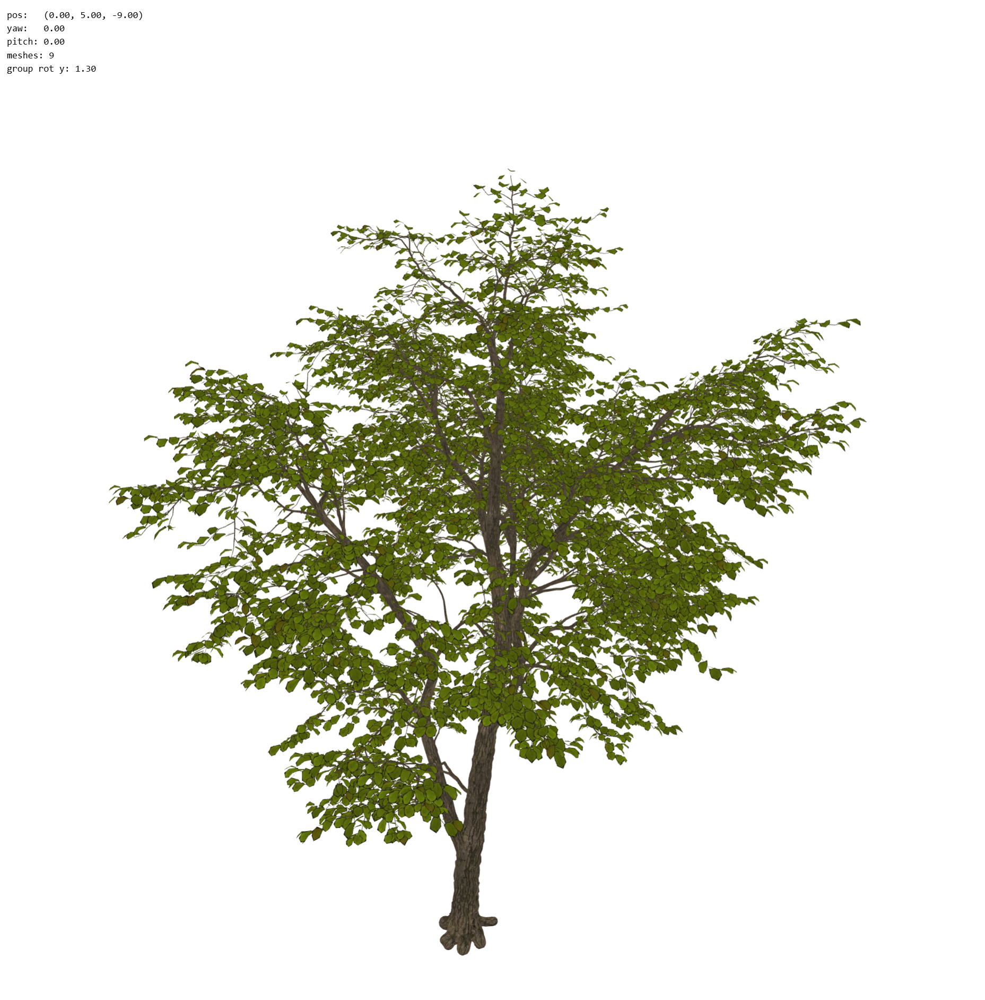

# 3d engine building

I had no previous experience in the theoretical back bone of 3d modelling really, but as a curious
person I had a series of questions about it and it eventually led me to
this rudimentary 3d engine implementation. 

You can find a demo of it here: [https://me.ricardicus.se/6327c5040352eadd45ae679f31f8f38](https://me.ricardicus.se/6327c5040352eadd45ae679f31f8f38a)
or launch it locally with for example

```
python3 -m http.server
```

then visit localhost:8000. 

## Background

This started as a small experimental inefficient CPU 3D renderer built from scratch,
then it got more refined. I was inspired by a [Youtube video](https://www.youtube.com/watch?v=qjWkNZ0SXfo)
by the account "Tsoding" where the author just created one from scratch capable of rendering
a wire frame of the Linux penguin.

In that spirit, I started out just rendering wire frames with the CPU but I wanted
to be able to render forms built in CAD tools or produced from 3D scans.
In my website (me.ricardicus.se) I use point clouds that form a 3d scan of me
and that scan is stored as a GLB file. So I then wanted to be able to render a GLB file
in my own engine, and that vision has now succeeded. 

I was using chatGPT for the webGL implementation, but
it was a good thing because it could explain to what it was doing and I had no 
previous experience with shader programs, so I feel like I've learned a lot from that.
I also argued that webgl API is a bit old, and it (as it so often does) agreed with me.

## Lessons learned 

## Vertices and indices

So, vertices are points. And indices, and indexes to these points.
The indices can form shapes based on the points, to explain how they
form shapes. You can for example draw lines based on the indices, then
you get a wireframe. Vertexes and indices are the building blocks
for creating meshes. You can create anything with these meshes, but
it turns out working with triangles has its benefits.

### All you've heard about triangles is true

I had heard that modern 3D graphics was based on triangles, and I 
have always wonders how exactly. The reason, as far as I see it, is 
that three points are the least amount of points you need to get
and idea about a bounded 2D plane projected into a 3D world.
For points ABC, you can do a cross-product of AB and AC to get the
3D world normal of this 2D plane projection. With this normal, you
can easily do optimizations should as excluding rendition (cull face)
or color/light effects is shaders (will describe shaders later).

#### Example, building a double-sided rectangle

So, building a double sided (can be seen from within) cube with vertices and indices could look like this (from the examples/rectangle_flow):

```javascript
function buildGeometryForCube(pos, pointsPerSide, sideLength=1.0) {
  const originX = pos.x;
  const originY = pos.y;
  const originZ = pos.z;
  const delta = sideLength / (pointsPerSide-1);

  const positions = [];
  const indices = [];
  const normals = [];

  function pushFaceNormal(nx, ny, nz, count) {
    for (let i = 0; i < count; i++) {
      normals.push(nx, ny, nz);
    }
  }

  // z = 0 side, xy-plane
  {
    for (let xi = 0; xi < pointsPerSide; xi++) {
      for (let yi = 0; yi < pointsPerSide; yi++) {
        let x = originX + delta * xi;
        let y = originY + delta * yi;
        let z = originZ;
        positions.push(x,y,z);
      }
    }
    pushFaceNormal(0, 0, -1, pointsPerSide * pointsPerSide);
    for (let xi = 0; xi < pointsPerSide-1; xi++) {
      for (let yi = 0; yi < pointsPerSide-1; yi++) {
        let i0 = yi + pointsPerSide * xi;
        let i1 = (yi+1) + pointsPerSide * xi;
        let i2 = yi + pointsPerSide * (xi + 1);
        let i3 = (yi+1) + pointsPerSide * (xi + 1);

        // Normal outward
        indices.push(i0);indices.push(i1);indices.push(i2);
        indices.push(i1);indices.push(i3);indices.push(i2);

        // Normal inward
        indices.push(i0);indices.push(i2);indices.push(i1);
        indices.push(i1);indices.push(i2);indices.push(i3);
      }
    }
  }

  // z = L side, xy-plane
  {
    const len = positions.length/3;
    for (let xi = 0; xi < pointsPerSide; xi++) {
      for (let yi = 0; yi < pointsPerSide; yi++) {
        let x = originX + delta * xi;
        let y = originY + delta * yi;
        let z = originZ + sideLength;
        positions.push(x,y,z);
      }
    }
    pushFaceNormal(0, 0, 1, pointsPerSide * pointsPerSide);
    for (let xi = 0; xi < pointsPerSide-1; xi++) {
      for (let yi = 0; yi < pointsPerSide-1; yi++) {
        let i0 = len + yi + pointsPerSide * xi;
        let i1 = len + (yi+1) + pointsPerSide * xi;
        let i2 = len + yi + pointsPerSide * (xi + 1);
        let i3 = len + (yi+1) + pointsPerSide * (xi + 1);

        // Normal outward
        indices.push(i0);indices.push(i2);indices.push(i1);
        indices.push(i1);indices.push(i2);indices.push(i3);

        // Normal inward
        indices.push(i0);indices.push(i1);indices.push(i2);
        indices.push(i1);indices.push(i3);indices.push(i2);
      }
    }
  }

  // y = 0 side, xz-plane
  {
    ...
  }

  // y = L side, xz-plane
  {
    ...
  }

  // x = 0 side, yz-plane
  {
    ...
  }

  // x = L side, yz-plane
  {
    ...
  }

  return {
    positions: new Float32Array(positions),
    indices: new Uint32Array(indices),
    normals: new Float32Array(normals),
  };
```

The same would be applied for all shapes!
The normals are extracted just for optimizations sake, but could be derived
using cross products of the triangles.

## A matter of perspective

"Is the things small, or just far away?"

The notion, x' = x/z, y' = y/z is pretty cool and deserving of 
a video [Youtube video](https://www.youtube.com/watch?v=qjWkNZ0SXfo).

In general, when you stand in the middle of a corridor- it appears as if 
the center of the corridor gets smaller and smaller the longer the corridor
moves. The door at the end of the corridor facing you appears smaller and smaller..

This is the depth perspective basis, shrink x and y according to distance.

If you move to the right, the thing in front of you moves to the left. This is
the relative position.

If you are a moving camera, you have a direction with which you move as well
as a relative position. This is the camera view transform from world space to camera space. 

Given a world-coordinate system point, p, you then get the transform, x'y'z', accordingly:

x' = dot(right,  (p - eye))
y' = dot(up,     (p - eye))
z' = dot(-forward, (p - eye))

where eye is the camera coordinates, right-up-forward is the direction vector of the eye
and p is the world coordinate. Now we can do this for every point and we will get a
perpective projection:

x_proj = x' / z'
y_proj = y' / z'

### Color

To render a surface, we compute a color for each fragment (pixel).
Often, a 2D texture is used. Each vertex then has a (u, v) coordinate,
which is a normalized (0–1) position inside the texture. These coordinates
are interpolated across the triangle so each fragment knows where to sample
its color. Another thing is how light is displayed. In the rectangle dance
example, we use a shader like this:

```webgl
precision mediump float;

varying vec3 vNormal;

uniform vec3 uLightDir;
uniform vec3 uBaseColor;

void main() {
  vec3 N = normalize(vNormal);
  vec3 L = normalize(uLightDir);

  float diffuse = max(dot(N, L), 0.0);
  float ambient = 0.25;

  vec3 color = uBaseColor * (ambient + diffuse);
  gl_FragColor = vec4(color, 1.0);
}
```

Essentially what it does, is that it sets gl_FragColor (the pixelcolor RGBA vector sent to WebGL)
based on the normal and the light direction. If the triangle points towards the light, it will
be as bright as possible, otherwise it will go dark. This is pretty standard.

## GPU acceleration

Now, my first implementation (see commit ac59a5591b382b4c0dadd6922e4528a65debb6f2) was completetly
CPU based. I could read the points, the uv-coordinates and 2d textures (for the color), from GLB file
of a tree. But the rendering was super slow. I needed the GPU rendering... 

So what does the GPU do?

Essentially, each vertex goes through the same transformation pipeline, which is why GPUs are so effective at this work.
I provide the GPU with vertex data, textures, and transformation matrices, and the GPU runs the rendering
pipeline much more efficiently than my CPU implementation.

Here is my vertex shader:

```webgl
attribute vec3 aPosition;
attribute vec2 aUv;

uniform mat4 uProjection;
uniform mat4 uView;
uniform mat4 uModel;

varying vec2 vUv;

void main() {
  vUv = aUv;
  gl_Position = uProjection * uView * uModel * vec4(aPosition, 1.0);
}
```

This is as basic as it gets! Provided a world coordinate potision, via the attribute aPosition, 
I transform the position into the camera view and send it to the GPU with the webGL variable gl_Position.
If I need to rotate or move the thing I want to view- I change the uModel 4D matrix to a rotation or
moving matrix. A rotation matrix rotates around the origin, so to rotate around another pivot, you first
translate the object so the pivot is at the origin, apply the rotation, and then translate back. This was done here:

```javascript
function makeGroupModelMatrix() {
  const toOrigin = makeTranslationMatrix(-groupCenter.x, -groupCenter.y, -groupCenter.z);
  const rotation = makeRotationYMatrix(groupRotationY);
  const back = makeTranslationMatrix(groupCenter.x, groupCenter.y, groupCenter.z);

  return multiplyMatrices(back, multiplyMatrices(rotation, toOrigin));
}
```

I had multiple meshes and they all formed the same object together, the tree. So I compute their
groupCenter (average xyz-value) and then rotate around that Y axis. In order to do that, I first move
the coordinates to origin, then move them back. All of this is linear and can be formed with matrix
multiplication and it works very well in the shader.

### Note on WebGL matrices

The webGL wants contigous memory even if it is a 4x4 matrix, it needs to be stored as a 1D array. 
So it stores it column-wise. For example here:

```javascript
function makeLookAtViewMatrix(cam) {
  const { forward, right, up } = getCameraBasis(cam);
  const eye = { x: cam.x, y: cam.y, z: cam.z };

  return new Float32Array([
    right.x, up.x, -forward.x, 0,
    right.y, up.y, -forward.y, 0,
    right.z, up.z, -forward.z, 0,
    -dot(right, eye), -dot(up, eye), dot(forward, eye), 1
  ]);
}
```

This matrix is used for uView in the shader, and it transforms points from world space into camera/view space. What to note here
is actually something like:

```javascript
[
  col0,
  col1,
  col2,
  col3
]
```

and it then becomes in math notation form:

```javascript
[  right.x           up.x           -forward.x          0
   right.y           up.y           -forward.y          0
   right.z           up.z           -forward.z          0
  -dot(right, eye)  -dot(up, eye)   dot(forward, eye)   1 ]
```

This is the world-to-camera transform matrix. The Float32Array is a flat array of 16 values, but it represents a 4×4 matrix.

### Itty-gritty comment

I find that the web GL API is a little strange. Consider these lines:

```javascript
  gl.bindBuffer(gl.ARRAY_BUFFER, drawable.positionBuffer);
  gl.enableVertexAttribArray(attribs.position);
  gl.vertexAttribPointer(attribs.position, 3, gl.FLOAT, false, 0, 0);

  gl.bindBuffer(gl.ARRAY_BUFFER, drawable.uvBuffer);
  gl.enableVertexAttribArray(attribs.uv);
  gl.vertexAttribPointer(attribs.uv, 2, gl.FLOAT, false, 0, 0);
```

Whta is goind on here? When looking at "enableVertexAttribArray" and "vertexAttribPointer"
and the arguments they use, it isn't clear at all that they operate on the data provided by 
the command gl.bindBuffer(gl.ARRAY_BUFFER, drawable.positionBuffer). I would expect something
moore like 

```
// fake code
let buf = gl.bindBuffer(gl.ARRAY_BUFFER, drawable.positionBuffer);
gl.enableVertexAttribArray(buf, attribs.position);
gl.vertexAttribPointer(buf, attribs.position, 3, gl.FLOAT, false, 0, 0);
```

But there is a reason the API looks like this, as always, and it is because WebGL maintains internal state like:

```
CURRENT ARRAY_BUFFER = positionBuffer
```
Then when you call:
```
gl.vertexAttribPointer(location, ...)
```
it means:
“Use the buffer currently bound to ARRAY_BUFFER for this attribute”

I thought this was a bit curious. Apparently, OpenGL is a 1990s design, and back then state machines were common
and minimizing function arguments was also something considered important.

## Other examples

You can run some examples also, found under "examples". 

- a set of rectangles vary their lengths using webGL shaders, it is live here: [https://me.ricardicus.se/64d743bdb2dfa8deb170784f771313b8](https://me.ricardicus.se/64d743bdb2dfa8deb170784f771313b8).
- walking around in a Half-Life mod map called "de\_dust2" (GoldSrc BSP & WAD), it is live here: [https://me.ricardicus.se/ee259790f841fbda5c5e65c5d85000a7](https://me.ricardicus.se/ee259790f841fbda5c5e65c5d85000a7)

### Screenshot

You can navigate the word by moving the camera using the arrows (direction) and the W-A-S-D keys for moving forward-left(stride)-back-right(stride).
I took this screenshot:



The HalfLife GoldSrc map loading, here is the map de_dust2, a mod for Counter-Strike:

